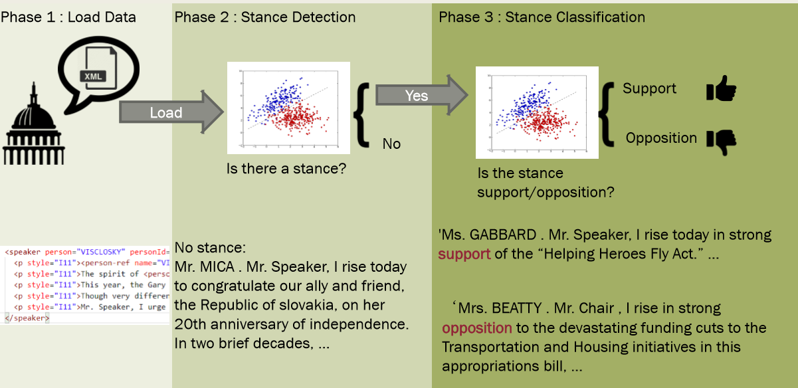
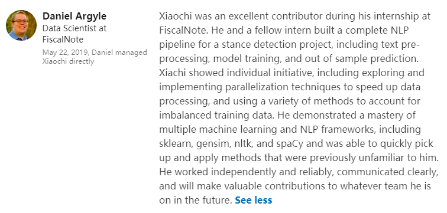

# Stance Detection and Stance Classification
Authors: [Xiaochi (George) Li](https://xc-li.github.io/), [Xiaodan Chen](https://github.com/chenxiaodan105)  
Capstone project of Data Science master's program at the George Washington University  
**Read our presentation in [presentation and report](./presentation%20and%20report)**


```
My contribution:
Major contributor (account for >70% of the contribution)
Design the framework of the project, lead another intern during the project. 
Data loading, relabeling, stance classification, EDA, visualization, deployment and writing major part of presentation, report, documentation.
```


## Usage
Environment: Anaconda, Spacy, Gensim, Keras, nltk

**NOTE: Please only read/use the code in ./deployment, code in other folders 
are legacy of previous development, and may not run as expected.**  
Clone this repository to local machine. Change current directory to `./deployment`

Usage Example:
```python
from stance_detection_classification import StanceDetectionAndClassification
sdac = StanceDetectionAndClassification()
sd = sdac.stance_detection(*string*) # sd is the probability that the speech contain stance
sc = sdac.stance_classification(*string*)  # sc is the probability that the speech contain positive stance 
```

Run Unit test: `> python3 test.py`

*class* **StanceDetectionAndClassification**  
**Methods:**  

- *\_\_init\_\_(self, data_path: str = '../opinion_mining/')*  
    Define the paths of data to retrain and trained model  
    **Parameter:** data_path: optional, the path to the data to retrain the models. 

- *retrain_stance_detection(self)*  
    Retrain the stance detection model 
- *retrain_stance_classification(self)*  
    Retrain the stance classification model
- *stance_detection(self, speech: str)*
    Stance Detection Model  
        **Parameter:** speech(string)   
        **Return:** float, the probability of the speech contain stance in it
- *stance_classification(self, speech: str)*
    Stance Classification Model  
        **Parameter:** speech(string)  
        **Return:** float, the probability of the speech contain positive 
        
## Models:

- Stance Detection: pre-trained GloVe + LSTM
- Stance Classification: Remove stop words+ tfidf + smote + Logistic Regression

## Underlying Components in util_code

*module* **util_code.corpus_loader**  
Useful to get speech from XML files, dependent on `util_code.xml_parser`
- Function: *corpus_loader(debug=False, parser='bs', data_root='../opinion_mining/')*  
    Match the record between action.csv and document.csv and load corpus from XML  

    **Parameters:**  
    - debug(Bool): the switch for debug  
    - parser(str): which parser to use, bs/xml  
    - data_root(str): the root of data and labels   

    **Returns:**  
    - Pandas DataFrame

- Function: *untagged_corpus_loader(tagged_df=None, path_root='../opinion_mining')*  
    Load all the untagged corpus from XML files

    **Parameters:**
    - tagged_df(Pandas DataFrame): the tagged data frame
    - path_root(str): the root of the path to search all XML files

    **Returns:**
    - untagged_data_frame(Pandas DataFrame): untagged data frame, in the same format of tagged_df
----
*class*  **util_code.Pipeline_V1.Pipeline**   
The one-stop pipeline for training, evaluating and diagnosing any sklearn model

**Attributes**  
- model : trained model
- vectorizer: trained vectorizer

**Methods:**

- *\_\_init\_\_(self, x, y, vectorizer, model, silent=False, sampler=None)*  
    Define the components of pipeline
    **Parameters:**
    - vectorizer: sklearn style vectorizer, has fit, transform methods
    - model: sklearn style model, has fit, predict, predict_proba methods
    - silent: Deprecated, please use in *exec()*
    - sampler: imblearn sampler, has fit_sample method
- *model_evaluation(self)*  
    Model evaluation, print confusion matrix, Log loss, classification report and Precision-Recall Plot
- *exec(self, silent=False)*  
    Run pipeline  
    **Parameter:** silent: bool, if True then return the F1 score as dictionary. If False then return the model and print the evaluations.
-----
*class* **util_code.mean_embedding_vectorizer.StackedMeanEmbeddingVectorizer**  
Stack mean embedding of Word2Vec to Bag of Words embedding  
Implemented in sklearn style

**Methods:**

- *\_\_init\_\_(self, vectorizer=None)*  
  **Parameter:** vectorizer: sklearn style vectorizer
- *load(self, file)*  
  **Parameter:** file(str): path to pre-trained Word2Vec model
- *fit(self, X)*  
  **Parameter:** X(one numpy column contain str), same to sklearn.vectorizer  
  **Return:** scipy.sparse: n_sample*n_features
- *transform(self, X)*  
  **Parameter:** X(one numpy column contain str), same to sklearn.vectorizer  
  **Return:** scipy.sparse: n_sample*n_features
-----
*class* **util_code.doc2vec_vectorizer.StackedD2V**  
Stack Doc2Vec embedding to Bag of Words embedding  
Implemented in sklearn style

**Methods:**

- *\_\_init\_\_(self, file, vectorizer=None)*  
  **Parameter:**
  - file(str): trained Doc2Vec model 
  - vectorizer: sklearn style vectorizer
- *load(self, file)*  
  **Parameter:** file(str): path to pre-trained Word2Vec model
- *fit(self, X)*  
  **Parameter:** X(one numpy column contain str), same to sklearn.vectorizer  
  **Return:** scipy.sparse: n_sample*n_features  
- *transform(self, X)*  
  **Parameter:** X(one numpy column contain str), same to sklearn.vectorizer  
  **Return:** scipy.sparse: n_sample*n_features
-----
*class* **util_code.Regex_Stance_Detection.RuleBasedStanceDetection**

**Methods:**

- *stance_detection_labeler(self, speech, strict=True, pn_ratio=1, cutoff=None)*  
  **Parameters:**
  - speech(str): the speech
  - strict(bool): only label as contain stance when detect positive or negative words.
  - pn_ratio(int,float): the parameter to control the weight of negative keywords
when both positive and negative keywords appear in the speech
  - cutoff(int): the cutoff point of the speech, only detect the keyword before cutoff  
  
  **Return:** int 1:contain stance, -1: not contain stance

- *stance_classification_labeler(self, speech, pn_ratio=1, cutoff=None)*
  **Parameters:**
  - speech(str): the speech
  - pn_ratio(int,float): the parameter to control the weight of negative keywords
when both positive and negative keywords appear in the speech
  - cutoff(int): the cutoff point of the speech, only detect the keyword before cutoff  

  **Return:** int 1:contain positive stance, -1: contain negative stance
-----
*module* **util_code.preprocess_utility**

**Functions:**

- spacy_lemma(speech:str) -> str  
  Lemmatization 
- remove_stopwords(text:str, cutoff:int=10000) -> str  
  Remove stop words, limit word in the sentence to *cutoff*
- remove_stopwords_return_list(text, cutoff=10000) -> List[str]
  Remove stop words, limit word in the sentence to *cutoff*, return list instead of combined string
-----
*module* **util_code.parallel_computing**

**Functions:**

- parallel_remove_stopwords(x:array of str) -> List[str]  
  Remove stop words, paralleled by python's multiprocessing library

-----

<details>
<summary>Xiaodan's contribution in util_code</summary>

*module* **util_code.data_preprocessing**

text preprocessing methods

- tokenize_text
  * tokenization
  
- remove_stopwords

- remove_special_characters
  * remove special characters --> '!"#$%&\'()*+,-./:;<=>?@[\\]^_`{|}'
  
- remove_non_alphabetic_characters
  * remove non-alphabetic characters and numbers
  
- remove_tokens_with_length
  * remove tokens with length less than or equal the input length
  
- get_common_tokens
  * get the vocabulary of the corpus
  
- relabel_data
  * using relabel algorithm to relabel untagged speeches
  
- change_labels
  * relabel '-1' to '0' for labels for later deep learning model
  
- split
  * a combination of text preprocessing, data relabeling and data splitting
  
  **Parameters**

    - min_speech_len:the maximum word count you use to control word frequency in a speech
    - max_speech_len:the minimum word count you use to control word frequency in a speech
    - max_wc: maintain word tokens that appear in the whole corpus that are less than max_wc words
    - min_wc: maintain word tokens that appear in the whole corpus that are more than min_wc words

  
- get_fixed_length_range_data
  * remove speeches whose length is shorter than min_len or longer than max_len 
  
- clean_corpus
  * ensure all speeches in a corpus only keep tokens between a minimum occurence and a maximum ocurrence

-----
*module* **util_code.lstm_train**
LSTM Model for stance detection

- keras_tokenizer
  - tokenization
  
- glove_embedding
  - load pretrained GloVe embedding
  
- LSTM_model
  - define model
  
- prediction
  - get f1 score on test data
  
- plot_history
  - visualization for loss and accuracy
  
- train
  - train model, save model and tokenizer
  
-----
*module* **util_code.sd_train**

a concise version of training model for stance detection

- **Parameters**
    - input_len: input length of speech to feed the deep learning
    - save_model_path : the path to the pretrained model
    - glove_path : the path to the pretrained GloVe embedding
    - tokenizer_path : the path to the pretrained vectorization tokenizer

-----
*module* **util_code.sd_evaluation**

get prediction and evaluation

-----
*class* **util_code.sd_prediction**

single speech prediction 
</details>


